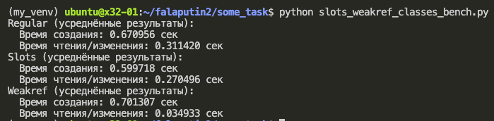
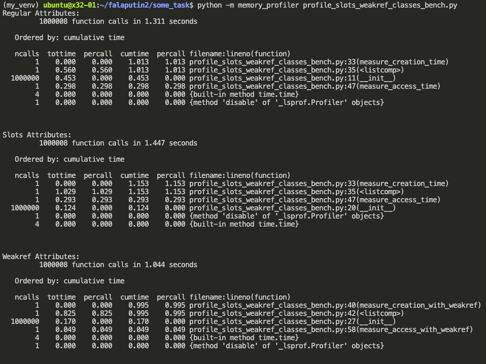
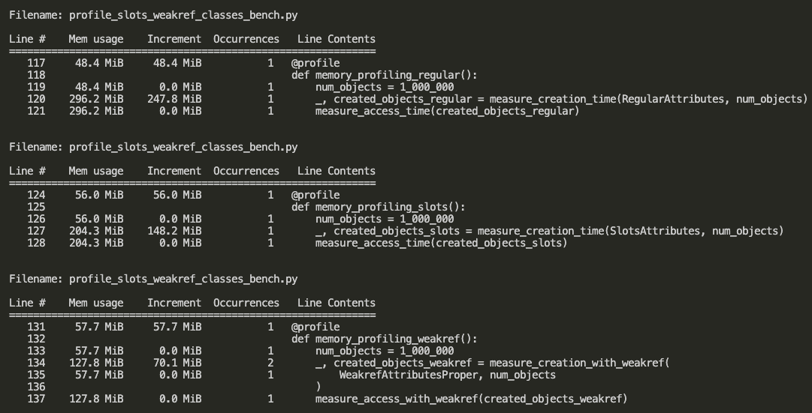

# Решение заданий

## Задание 1

**Вывод:**
Слоты позволяют получанить самое быстрое время создания объектов, weakref позволили получить самое быстрое время на чтение и запись. Использование обычных аттриубутов проигрывает во всех случаях.

## Задание 2

**Вывод:**
#### Regular Attributes

- Основные затраты времени:
  - на инициализацию объекта __init__: 0.453
  - measure_creation_time: 1.013 секунды
  - measure_access_time: 0.298 секунды

Класс __RegularAttributes__ демонстрирует долгое время выполнения в функции measure_creation_time, что указывает на значительные накладные расходы при создании объектов с динамическими атрибутами. Доступ к атрибутам также потребляет существенное время.

#### Slots Attributes

- Основные затраты времени:
  - на инициализацию объекта __init__: 0.124
  - measure_creation_time: 1.153 секунды
  - measure_access_time: 0.124 секунды

Класс __SlotsAttributes__, имеет более быстрое время на инициалзацию одного объекта, а также на доступ к атрибутам.

#### Weakref Attributes

- Основные затраты времени:
  - на инициализацию объекта __init__: 0.170
  - measure_creation_with_weakref: 0.995 секунды
  - measure_access_with_weakref: 0.049 секунды

Класс __WeakrefAttributes__, имеет немного более время на инициалзацию одного объекта по сравнению с __SlotsAttributes__, однако всё же более быстрое, чем __RegularAttributes__. Есть выигрыш во времени на доступ к атрибутам.

**Вывод:**

#### Regular Attributes

- Начальное использование памяти: 48.4 MiB
- После создания объектов: увеличение на 247.8 MiB (до 296.2 MiB)

## Slots Attributes

- Начальное использование памяти: 56.0 MiB
- После создания объектов: увеличение на 148.2 MiB (до 204.3 MiB)

Использование SlotsAttributes позволяет значительно сократить объем используемой памяти по сравнению с RegularAttributes. Это достигается за счет ограничения объекта фиксированным набором атрибутов с использованием __slots__, что уменьшает накладные расходы.

#### Weakref Attributes

- Начальное использование памяти: 57.7 MiB
- После создания объектов: увеличение на 70.1 MiB (до 127.8 MiB)

Класс WeakrefAttributes имеет наименьшее увеличение использования памяти. Это объясняется применением слабых ссылок, которые не удерживают объекты в памяти, если они больше не используются в программе.
